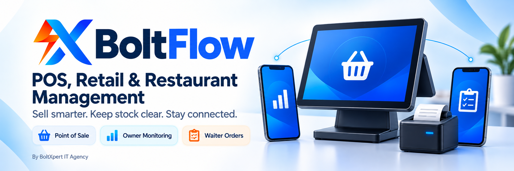

# BoltFlow — POS, Retail & Restaurant Management Software

**Sell smarter. Keep stock clear. Stay connected to your business.**

BoltFlow brings point of sale, inventory, invoices and daily reporting together—with companion apps for remote owner monitoring and local-network order taking.

[View Releases](https://github.com/boltxpert/boltflow-downloads/releases) · [Request a Demo](https://wa.me/923407000792?text=Hello%2C%20I%20would%20like%20a%20BoltFlow%20demo.) · [Licensing & Pricing](https://wa.me/923407000792?text=Hello%2C%20please%20share%20BoltFlow%20licensing%20and%20pricing%20details.)

**Windows & Android POS** · **Owner Monitoring** · **Waiter Order Taking**

## One business. Connected applications.

| Application | Purpose | Connection |
| --- | --- | --- |
| **BoltFlow POS** | Desktop and mobile sales operations, products, stock, invoices and business reporting. | Windows POS is the central terminal for the Waiter workflow. Mobile features vary by version. |
| **BoltFlow Owner** | Monitor linked companies and branches, sales, expenses and business activity from Android. | Internet-based monitoring through the configured cloud service and authorized POS synchronization. |
| **BoltFlow Waiter** | Take table and takeaway orders, browse the menu, add preparation notes and review order status on Android. | Connects to BoltFlow POS Desktop over the same Wi-Fi/LAN. |

Owner monitoring does not require the same Wi-Fi as the shop. Waiter order taking uses the local POS connection; remote monitoring is not a substitute for that LAN connection.

## Features for everyday business

- **Fast checkout:** product search, barcode entry, cashier-based sales and invoice history.
- **Stock visibility:** products and categories, quantity tracking, low-stock monitoring and inventory summaries.
- **Invoices & receipts:** thermal receipts, PDF/print workflows and refund handling, subject to supported printers and edition.
- **Daily operations:** expenses, sales reports, shifts and session history with manager/cashier access controls.
- **Owner insights:** sales totals, order counts, refunds, discounts, top products, recent transactions and branch availability.
- **Table-side service:** dine-in/takeaway orders, table selection, kitchen notes and waiter-specific order history.
- **Recovery & continuity:** local POS storage and backup tools; the Waiter app can retain pending orders during temporary disconnections and synchronize after reconnection.

Capabilities depend on the installed edition, business configuration and enabled services. Owner figures reflect the latest synchronized records; offline orders are not received by POS until successfully synchronized.

## Screenshots

| POS checkout | Inventory & invoices |
| :---: | :---: |
| *Screenshot coming soon* | *Screenshot coming soon* |
| **Owner dashboard** | **Waiter order taking** |
| *Screenshot coming soon* | *Screenshot coming soon* |

<!-- Add real demo-data screenshots to screenshots/pos-checkout.png,
screenshots/inventory-invoices.png, screenshots/owner-dashboard.png and
screenshots/waiter-orders.png. Do not publish customer records, credentials,
connection codes or private financial information. -->

## Versions & getting started

**[Download the September 2026 app bundle](https://github.com/boltxpert/boltflow-downloads/releases/tag/bundle-2026-09-11)** — versions verified on 11 September 2026:

| Application | Platform | Version |
| --- | --- | --- |
| [BoltFlow POS Desktop](https://github.com/boltxpert/boltflow-downloads/releases/download/bundle-2026-09-11/BoltFlowPOS_Setup_v3.3.4.exe) | Windows | **3.3.4** |
| [BoltFlow POS Mobile](https://github.com/boltxpert/boltflow-downloads/releases/download/bundle-2026-09-11/BoltFlowPOS_v3.2.6.apk) | Android | **3.2.6** |
| [BoltFlow Owner](https://github.com/boltxpert/boltflow-downloads/releases/download/bundle-2026-09-11/BoltFlow_Owner_v2.6.0.apk) | Android | **2.6.0** |
| [BoltFlow Waiter](https://github.com/boltxpert/boltflow-downloads/releases/download/bundle-2026-09-11/BoltFlow_Waiter_v1.7.apk) | Android | **1.7.0** |

The supplied Android packages require **Android 7.0 or newer**. Version numbers are independent across applications.

**Signing notice:** the supplied APKs use an Android Debug certificate; the Windows installer is not code-signed. Files are distributed unchanged. Read the [release notes and installation precautions](https://github.com/boltxpert/boltflow-downloads/releases/tag/bundle-2026-09-11) and verify downloads using the attached `SHA256SUMS.txt`.

1. Confirm your business requirements, license and supported devices with our team.
2. Install POS and configure products, staff and receipt printers.
3. Connect Waiter devices to the POS local server; authorize cloud linking separately for Owner monitoring.

## Licensing, terms & responsible use

- **Proprietary, licensed software:** public repository access does not grant an open-source license or rights to the application source code.
- **Agreed terms apply:** pricing, activation, device limits, cloud access, support, updates, renewal and any refunds are governed by your quotation or license agreement.
- **Connectivity matters:** remote monitoring requires internet access and enabled synchronization. Waiter submissions require a reachable, authorized POS server.
- **Protect business records:** review transactions, maintain secure backups and synchronize pending work before updates. Contact support before uninstalling an app holding business data.
- **Privacy:** keep passwords, linking codes and customer information out of public issues and screenshots. Only install files obtained through verified release or support channels.

## Built by BoltXpert IT Agency

**Team Lead:** Asad Ullah · **Location:** Layyah, Pakistan

[WhatsApp: +92 340 7000792](https://wa.me/923407000792) · [Email: boltxpert@gmail.com](mailto:boltxpert@gmail.com) · [Website](https://boltxpert.com)

**Ready to connect your counter, staff and business insights? [Request a BoltFlow demo.](https://wa.me/923407000792?text=Hello%2C%20I%20would%20like%20a%20BoltFlow%20demo.)**
